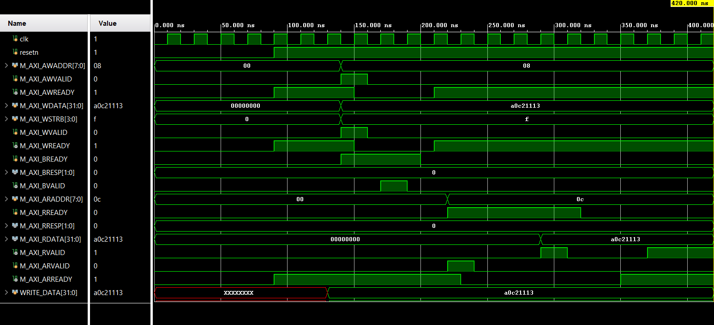
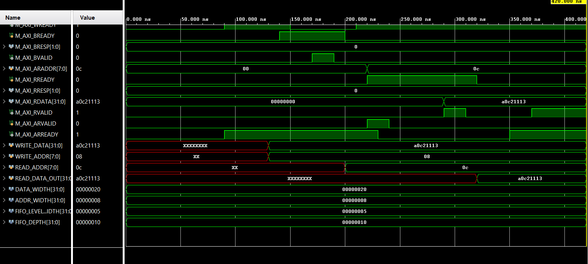

# AXI4-Lite FIFO Controller

## Overview

This project implements an AXI4-Lite controlled FIFO peripheral in Verilog. The design exposes a small memory-mapped register interface through which an AXI4-Lite master can write data into a synchronous FIFO, read data back from the FIFO, and monitor basic FIFO status/error conditions.

The project was developed to understand AXI4-Lite handshaking, memory-mapped register design, FIFO control logic, and basic RTL verification using a Verilog testbench.

## Features

* AXI4-Lite slave interface with separate write and read channels
* Memory-mapped register interface for FIFO access and status monitoring
* Synchronous FIFO with full, empty, overflow, underflow, and level tracking
* Status and error registers for debug and control
* Verilog testbench with AXI-style write and read tasks
* Basic write-read operation verified through simulation

## Block Diagram

```text
AXI4-Lite Master Testbench
          |
          |  AW/W/B/AR/R Channels
          v
AXI4-Lite Slave Register Interface
          |
          |  fifo_wr_en / fifo_rd_en
          v
Synchronous FIFO
```

## Register Map

| Address | Register     | Access | Description                                       |
| ------- | ------------ | ------ | ------------------------------------------------- |
| `0x00`  | CONTROL      | Write  | Control register, used for clearing error flags   |
| `0x04`  | STATUS       | Read   | FIFO status summary                               |
| `0x08`  | DATA_IN      | Write  | Writing to this address pushes data into the FIFO |
| `0x0C`  | DATA_OUT     | Read   | Reading from this address pops data from the FIFO |
| `0x10`  | FIFO_LEVEL   | Read   | Shows the current number of valid FIFO entries    |
| `0x14`  | ERROR_STATUS | Read   | Shows detailed error flags                        |

## STATUS Register Bit Mapping

| Bit      | Signal          | Description                        |
| -------- | --------------- | ---------------------------------- |
| `[0]`    | `fifo_full`     | FIFO is full                       |
| `[1]`    | `fifo_empty`    | FIFO is empty                      |
| `[2]`    | `err_overflow`  | Write attempted when FIFO was full |
| `[3]`    | `err_underflow` | Read attempted when FIFO was empty |
| `[4]`    | `any_error`     | Any error flag is active           |
| `[31:5]` | Reserved        | Reads as zero                      |

## ERROR_STATUS Register Bit Mapping

| Bit      | Error                 | Description                             |
| -------- | --------------------- | --------------------------------------- |
| `[0]`    | Overflow              | Write attempted when FIFO was full      |
| `[1]`    | Underflow             | Read attempted when FIFO was empty      |
| `[2]`    | Invalid Write Address | Write attempted to unsupported address  |
| `[3]`    | Invalid Read Address  | Read attempted from unsupported address |
| `[4]`    | WSTRB Error           | Unsupported partial write strobe        |
| `[31:5]` | Reserved              | Reads as zero                           |

## Design Details

### AXI4-Lite Write Path

The write path uses the AXI4-Lite write address, write data, and write response channels.

* `AWADDR` selects the target register.
* `WDATA` carries the write data.
* `WSTRB` is checked to support only full 32-bit writes.
* `BRESP` returns the write response.

When the master writes to the `DATA_IN` register at address `0x08`, the controller generates a FIFO write enable pulse and passes `WDATA` into the FIFO.

### AXI4-Lite Read Path

The read path uses the AXI4-Lite read address and read data channels.

* `ARADDR` selects the register to read.
* `RDATA` returns register data or FIFO output data.
* `RRESP` returns the read response.

Reading the `DATA_OUT` register at address `0x0C` pops one word from the FIFO. Since the FIFO read output is registered, the read FSM includes wait states before asserting `RVALID` with valid FIFO data.

### FIFO

The FIFO is a synchronous FIFO with parameterized data width and depth. It tracks:

* write pointer
* read pointer
* FIFO level
* full/empty status
* overflow/underflow events

## Simulation and Verification

A Verilog testbench is used as an AXI4-Lite master. It includes reusable tasks for AXI write and AXI read transactions.

The basic verified sequence is:

1. Apply reset and release reset.
2. Write a 32-bit data word to the `DATA_IN` register.
3. Store the data inside the synchronous FIFO.
4. Read the data back from the `DATA_OUT` register.
5. Compare the read data with the written data.

Example verified transaction:

```text
Written Data : 0xA0C21113
Read Data    : 0xA0C21113
```

## Simulation Waveforms

### AXI4-Lite Write Transaction

The waveform below shows the AXI4-Lite write operation to the `DATA_IN` register at address `0x08`. The write transaction uses the `AW`, `W`, and `B` channels. A successful write response is indicated by `BRESP = 00`.



### AXI4-Lite Read Transaction

The waveform below shows the AXI4-Lite read operation from the `DATA_OUT` register at address `0x0C`. The read data returned is `0xA0C21113`, matching the previously written data. A successful read response is indicated by `RRESP = 00`.



## Files

```text
axi_lite_slave.v          # AXI4-Lite slave register interface and FIFO controller
sync_fifo.v               # Synchronous FIFO
axi_lite_master_tb.v      # Verilog testbench acting as AXI4-Lite master
AXI_waveform_image_01.png # Write transaction waveform
AXI_waveform_image_02.png # Read transaction waveform
```

## Tools Used

* Verilog HDL
* Xilinx Vivado
* XSim Simulator

## Current Limitations

* The design supports AXI4-Lite single-register transactions only.
* AXI burst transfers are not supported because AXI4-Lite does not include burst support.
* Partial writes using `WSTRB` are currently treated as an error.
* Verification currently uses directed simulation tests.

## Possible Future Improvements

* Add more directed tests for overflow, underflow, invalid address, and clear-error operation.
* Add assertion-based checks for AXI handshaking rules.
* Add interrupt output for FIFO status/error events.
* Package the design as a Vivado custom IP.
* Extend the design toward a memory-to-memory data mover using AXI4-Full or AXI-Stream.
